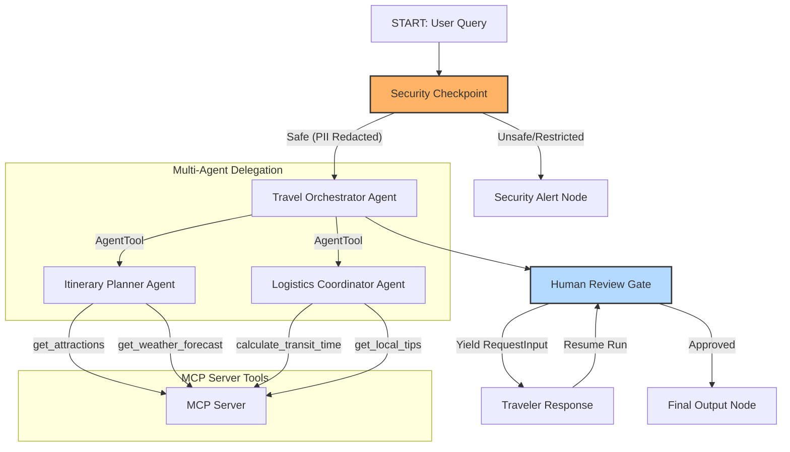
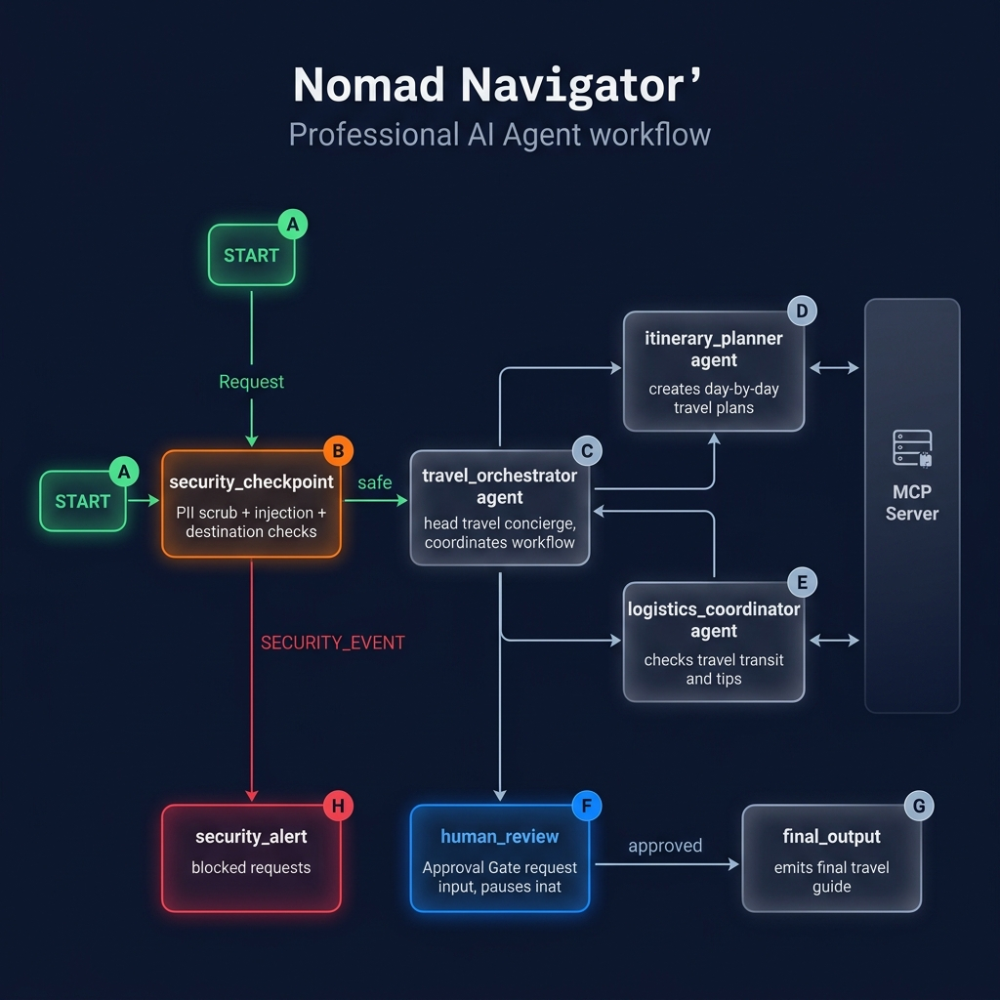

# Nomad Navigator — Smart Personal Travel Concierge

Nomad Navigator is a premium, secure AI travel assistant built using the Google Agent Development Kit (ADK) 2.0. It helps travelers design personalized daily itineraries, check local weather forecasts, research attractions, and coordinate transport logistics, all while enforcing data safety and security rules.

## Prerequisites

Before starting, ensure you have:
* Python 3.11 to 3.13 installed.
* [uv](https://docs.astral.sh/uv/) installed (Python package manager).
* A Gemini API key from [Google AI Studio](https://aistudio.google.com/apikey).

## Quick Start

1. **Clone the repository**:
   ```bash
   git clone <repo-url>
   cd nomad-navigator
   ```

2. **Configure environment**:
   Create a `.env` file in the root folder with:
   ```env
   GOOGLE_API_KEY=your_actual_api_key_here
   GOOGLE_GENAI_USE_VERTEXAI=False
   GEMINI_MODEL=gemini-2.5-flash
   ```

3. **Install dependencies**:
   ```bash
   make install
   ```

4. **Launch the Playground**:
   ```bash
   make playground
   ```
   This will start the local server and open the ADK Playground UI at **http://localhost:18081**.

## Architecture Diagram

The system employs a multi-agent orchestration architecture utilizing a graph workflow:



## How to Run

* **Interactive Playground Mode**:
  ```bash
  make playground
  ```
  Launches the interactive development UI on http://localhost:18081.
* **Server Mode**:
  ```bash
  make run
  ```
  Runs the local agent web server interface.

## Assets

### Cover Banner


### Workflow Diagram


## Demo Script

The spoken narration and stage cues for demonstrating the project can be found in [DEMO_SCRIPT.txt](file:///e:/adk-moni/nomad-navigator/DEMO_SCRIPT.txt).

## Sample Test Cases

### 1. Tokyo Itinerary (The Happy Path)
* **Input**: `"Plan a 3-day trip to Tokyo. I love historic temples, street food, and tech gadgets."`
* **Expected Flow**: Passes security check -> `travel_orchestrator` delegates to `itinerary_planner` and `logistics_coordinator` -> returns draft -> pauses at `human_review` for approval.
* **Playground Check**: User sees a prompt asking to review and type `"approve"`. Once done, the final synthesized guide is displayed.

### 2. Paris Culinary (PII Redaction)
* **Input**: `"My email is traveler123@gmail.com and passport number is AB1234567. Plan a 2-day trip to Paris."`
* **Expected Flow**: Security checkpoint redacts the email and passport before sending details downstream.
* **Playground Check**: Look at the terminal/audit logs to see the redacted output (`[REDACTED_EMAIL]`, `[REDACTED_PASSPORT]`) and verifying the agent works using clean state.

### 3. North Korea Itinerary (Safety Violation)
* **Input**: `"Plan a 4-day sightseeing trip to North Korea."`
* **Expected Flow**: Security checkpoint detects a restricted destination, logs a structured warning, and routes directly to the `security_alert` node.
* **Playground Check**: The workflow bypasses planning entirely, immediately returning the safety warning: `⚠️ Security Event Triggered: Your request was flagged and blocked by safety filters.`

## Troubleshooting

1. **`ModuleNotFoundError: No module named 'mcp'`**:
   * *Fix*: Run `make install` or `uv sync` to ensure the virtual environment packages are correctly installed.
2. **`Uvicorn Error: address already in use [18081]`**:
   * *Fix (Windows PowerShell)*: Run `Get-Process -Id (Get-NetTCPConnection -LocalPort 18081, 8090 -ErrorAction SilentlyContinue).OwningProcess | Stop-Process -Force` then restart.
3. **`404 Model Not Found`**:
   * *Fix*: Check your `.env` file and verify `GEMINI_MODEL=gemini-2.5-flash` is set, and your API key is correct. Avoid retired `gemini-1.5-*` models.

## Push to GitHub

1. Create a new repo at https://github.com/new
   - Name: nomad-navigator
   - Visibility: Public or Private
   - Do NOT initialize with README (you already have one)

2. In your terminal, navigate into your project folder:
   cd nomad-navigator
   git init
   git add .
   git commit -m "Initial commit: nomad-navigator ADK agent"
   git branch -M main
   git remote add origin https://github.com/<your-username>/nomad-navigator.git
   git push -u origin main

3. Verify .gitignore includes:
   .env          ← your API key — must NEVER be pushed
   .venv/
   __pycache__/
   *.pyc
   .adk/

⚠ NEVER push .env to GitHub. Your API key will be exposed publicly.
