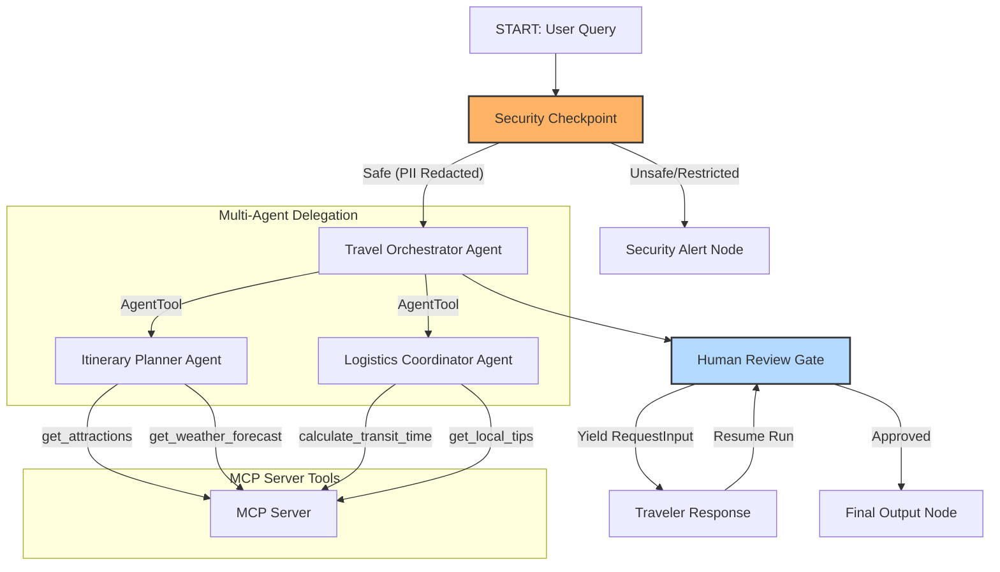

# Nomad Navigator — Submission Writeup

## Problem Statement
Planning a vacation or travel itinerary is time-consuming and fragmented. Travelers must manually research attractions, cross-reference weather forecasts, understand transit options, and find local customs. Traditional travel planners are either static web directories or simple chat assistants that output raw LLM answers without verification or grounding.
Additionally, when travelers interact with AI services, they often share sensitive details (like passports or contact numbers), presenting security risks.
**Nomad Navigator** addresses this by providing a secure, grounded multi-agent travel planner that validates queries, redacts personal information, runs a local toolchain via MCP to fetch real-world data, and coordinates planning before requesting human approval.

## Solution Architecture
Nomad Navigator uses the ADK 2.0 graph workflow:

## Concepts Used

1. **ADK Workflow**: Implemented as the root graph wrapper in [app/agent.py](file:///e:/adk-moni/nomad-navigator/app/agent.py#L182-L194) to enforce execution flow, handle conditional routing, and structure nodes.
2. **LlmAgent**: Used for specialized sub-agents `itinerary_planner` and `logistics_coordinator` in [app/agent.py](file:///e:/adk-moni/nomad-navigator/app/agent.py#L21-L47) to query LLM endpoints.
3. **AgentTool**: Declared on the `travel_orchestrator` in [app/agent.py](file:///e:/adk-moni/nomad-navigator/app/agent.py#L60) to delegate planning and verification tasks to the sub-agents.
4. **MCP Server**: Designed in [app/mcp_server.py](file:///e:/adk-moni/nomad-navigator/app/mcp_server.py) to provide local tool execution (weather, transit, local tips) to the sub-agents.
5. **Security Checkpoint**: Implemented as the `security_checkpoint` function node in [app/agent.py](file:///e:/adk-moni/nomad-navigator/app/agent.py#L74-L127) to scrub input, prevent prompt injections, and filter restricted queries.
6. **Agents CLI**: Project scaffolded with `agents-cli scaffold create` and configured with a custom `GEMINI.md` and local developer `Makefile`.

## Security Design

Nomad Navigator prioritizes privacy and security at the gate:
* **PII Scrubbing**: Detects and redacts emails, phone numbers, and passport formats (critical for international bookings) using regular expressions. This prevents credentials or credentials formats from being leaked to downstream logs.
* **Prompt Injection Detection**: Scans inputs against common injection triggers (like instructions overrides or jailbreak keywords). Flagged attempts are blocked immediately.
* **Dangerous Destinations**: Limits travel recommendations to safe regions by blocking queries targeting highly dangerous/sanctioned destinations.
* **Audit Logging**: Emits structured JSON payloads detailing safety checks and severity metadata for compliance monitoring.

## MCP Server Design
The local Model Context Protocol (MCP) server in `app/mcp_server.py` exposes:
* **`get_attractions`**: Grounding tool for finding popular landmarks and activities in targeted cities.
* **`get_weather_forecast`**: Ensures itineraries are planned for the correct climate/conditions.
* **`calculate_transit_time`**: Estimates times and distances between sights to keep daily schedules realistic.
* **`get_local_tips`**: Grounding tool for cultural norms, tipping, and regional advice.

## HITL (Human-in-the-Loop) Flow
The itinerary planning requires traveler feedback before locking in details.
* **Location in Graph**: Placed at `human_review` in `app/agent.py`.
* **Implementation**: The node yields a `RequestInput` with the draft itinerary.
* **Reasoning**: Travel changes are expensive. Halting the workflow forces the traveler to explicitly type `"approve"` in their UI, confirming the plan matches their desires before finishing the itinerary.

## Demo Walkthrough
1. **The Happy Path (Tokyo)**: User requests a Tokyo itinerary. The query passes security and delegates to planners. It stops at the approval gate, requiring user input before displaying the final structured itinerary.
2. **PII Redaction (Paris)**: User provides passport details during the query. The security checkpoint redacts this information. The agent plans the itinerary safely without saving the passport to context.
3. **Safety Block (North Korea)**: User asks for a trip to a high-risk destination. The security checkpoint triggers a safety block, logs the attempt, and routes to `security_alert`.

## Impact / Value Statement
Nomad Navigator transforms manual travel planning into a secure, automated, and human-supervised task. By utilizing a multi-agent structure grounded in local MCP tools, travelers get highly realistic daily itineraries while maintaining strict privacy boundaries.
